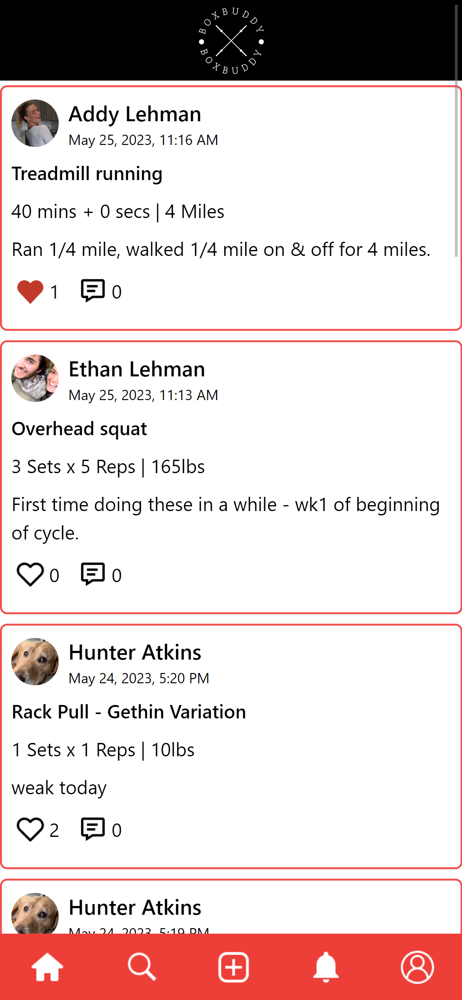

# Box Buddy (Full-Stack Mobile Project)
Box Buddy is a community-based mobile fitness application where users can build up their profiles, post workouts, track personal fitness records, and interact with friends.
  
## Live Link: 🔗

Access our site at (link)
  
## Table of Contents: 📚

* [About Box Buddy](#about) 
* [Screenshots](#screen) 
* [Technologies](#tech) 
* [Approach](#approach) 
* [Status](#status) 
* [Credits](#credits)
  
## About Box Buddy: 

### <b>Swap Page:</b>
Hermes' swap interface allows users to select a cryptocurrency, and provides real-time conversion of the selected cryptocurrency to another cryptocurrency based on current market prices. It's main function is a swap feature that allows users to swap one cryptocurrency for another. Additionally, it has a "max" button that allows users to input the maximum amount of cryptocurrency they have available for trading. The script fetches market prices of Hermes' supported cryptocurrencies from the CoinGecko public API.
 

  
## Screenshots: 📷

### <b>Home:</b> 
</img>

### <b>Search Friends:</b> 
</img>

### <b>Create New Post:</b> 
</img>

### <b>Notifications:</b> 
</img>

### <b>Profile:</b> 
</img>

### <b>Personal Records:</b> 
</img>

### <b>Comments:</b> 
</img>

  
## Technologies: 💻

- JavaScript
- Tailwind CSS
- Node.js
- Express JS
- Sequelize
- PostgreSQL
- Passport
- bcryptjs
- Cookie Session
- Database GUI: Beekeeper
- Cloudinary
- Multer
- API: <a class="apiLink" href="https://api-ninjas.com/api/exercises">API-Ninjas (Exercises)</a>
  
## Approach: 💭

<b>Hunter:</b> 
My approach for our front-end project was to create a website that would be useful to many people. I think that we accomplished this goal in the sense that, through the use of our app, anyone can get experience in trading crypto without the risk of losing their hard-earned assets. 
 
I wanted to make sure that our site was consistent in its styling across all pages. This was accomplished by creating an initial CSS file which contained the basic styling for the navbar and content section, which was linked to every HTML page. 
 
With a basic template for all of our HTML pages complete, we were able to split up tasks efficiently and create pull requests with minimal merge conflicts.   
<b>Ethan:</b> 
As someone who is very passionate about Decentralized Finance and the future that cryptocurrencies can create, I was highly motivated by this project. Hunter and I collaborated well and partitioned tasks efficiently. This made the building process smooth, fast, and clean.  
Throughout this project, my main focus was to incorporate accurate trading conversions between cryptocurrencies and price charts for each token. Beyond this, I ensured a mutual styling theme between pages with attention to small details and mobile friendliness.  Hunter and I both leveraged each other's strengths to create a beginner-friendly (fake money) and realistic cryptocurrency application. 

  
## Status: 📶

Box Buddy is in beta stage of development. This was a 1 week full-stack project built by Hunter and Ethan starting week 10 and ending week 11 of DigitalCrafts Bootcamp.
  
## Credits: 🙌

### Contributors: 
<a href="">Hunter Atkins</a> & <a href="https://www.linkedin.com/in/ethan-lehman-444b68220/">Ethan Lehman</a> 
</img>
</img>
 
### Powered by:  
